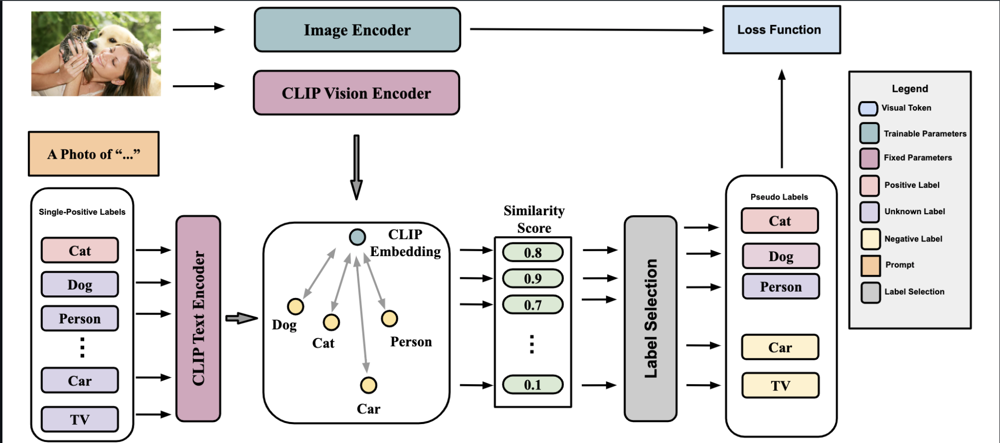

# VLPL: Vision Language Pseudo Labels for Multi-label Learning with Single Positive Labels

[](https://arxiv.org/abs/2310.15985)
[](LICENSE)

Official PyTorch implementation of **VLPL**, a vision-language pseudo-labeling approach for multi-label image classification under the single-positive label setting.

**Authors:** Xin Xing, Zhexiao Xiong, Abby Stylianou, Srikumar Sastry, Liyu Gong, and Nathan Jacobs  
**Corresponding author:** [Xin Xing](https://xinxing99.github.io/) (xxing@unomaha.edu)

<div align="center">

</div>

---

## Overview

Multi-label image classification requires annotating all classes present in an image, which is expensive and error-prone. The **single-positive label** setting reduces this cost by annotating only one positive class per image, even when multiple classes are present. Existing methods for this setting rely primarily on novel loss functions; pseudo-label approaches have historically underperformed.

**VLPL** uses a pretrained vision-language model (CLIP) to generate strong positive and negative pseudo-labels, supplementing the sparse single-positive supervision signal.

**Key contributions:**
- Vision-language pseudo-labeling strategy that proposes reliable positive and negative pseudo-labels from CLIP similarity scores
- Demonstrated on four benchmarks: Pascal VOC, MS-COCO, NUS-WIDE, and CUB-Birds
- Outperforms prior SOTA by **+5.4%** (VOC), **+15.6%** (COCO), **+15.2%** (NUS-WIDE), and **+11.3%** (CUB) when using a stronger backbone

---

## Installation

Requires Python 3.8 and a CUDA-capable GPU.

```bash
conda create --name vlpl python=3.8.8
conda activate vlpl
pip install -r requirements.txt
```

---

## Data

### 1. Download raw data

**PASCAL VOC**
```bash
cd data/pascal
curl http://host.robots.ox.ac.uk/pascal/VOC/voc2012/VOCtrainval_11-May-2012.tar --output pascal_raw.tar
tar -xf pascal_raw.tar
rm pascal_raw.tar
```

**MS-COCO**
```bash
cd data/coco
curl http://images.cocodataset.org/annotations/annotations_trainval2014.zip --output coco_annotations.zip
curl http://images.cocodataset.org/zips/train2014.zip --output coco_train_raw.zip
curl http://images.cocodataset.org/zips/val2014.zip --output coco_val_raw.zip
unzip -q coco_annotations.zip
unzip -q coco_train_raw.zip
unzip -q coco_val_raw.zip
rm coco_annotations.zip coco_train_raw.zip coco_val_raw.zip
```

**NUS-WIDE**
1. Download `Flickr.zip` from the [NUS-WIDE website](https://lms.comp.nus.edu.sg/wp-content/uploads/2019/research/nuswide/NUS-WIDE.html).
2. Move and extract:
```bash
mv /path/to/Flickr.zip data/nuswide/
cd data/nuswide && unzip -q Flickr.zip && rm Flickr.zip
```

**CUB-Birds**
1. Download `CUB_200_2011.tgz` from [Caltech](https://data.caltech.edu/records/20098).
2. Move and extract:
```bash
mv /path/to/CUB_200_2011.tgz data/cub/
cd data/cub && tar -xf CUB_200_2011.tgz && rm CUB_200_2011.tgz
```

### 2. Format data

For PASCAL VOC, MS-COCO, and CUB, run from the repository root:
```bash
python preproc/format_pascal.py
python preproc/format_coco.py
python preproc/format_cub.py
```

For NUS-WIDE, download the pre-formatted files from [Google Drive](https://drive.google.com/drive/folders/1YL7WhnGpd-pjbtPL5r6IKiPeYFVdpYne?usp=sharing) and place them in `data/nuswide/`:
- `formatted_train_images.npy`
- `formatted_train_labels.npy`
- `formatted_val_images.npy`
- `formatted_val_labels.npy`

### 3. Generate single-positive annotations

```bash
python preproc/generate_observed_labels.py --dataset <DATASET>
```
`<DATASET>` ∈ {`pascal`, `coco`, `nuswide`, `cub`}

---

## Usage

### Training and Evaluation

Run `main_clip.py` to train and evaluate a model:

```bash
python main_clip.py -d <DATASET> -l <LOSS> -g <GPU> -m <MODEL> -t <TEMP> -th <THRESHOLD> -p <PARTIAL> -s <SEED>
```

| Argument | Flag | Default | Options |
|---|---|---|---|
| Dataset | `-d` | `pascal` | `pascal`, `coco`, `nuswide`, `cub` |
| Loss | `-l` | `EM_PL` | `bce`, `iun`, `an`, `EM`, `EM_APL`, `EM_PL` |
| GPU index | `-g` | `0` | `0`, `1`, `2`, `3` |
| Backbone | `-m` | `resnet50` | `resnet50`, `clip_vision`, `convnext_xlarge_22k`, `convnext_xlarge_1k` |
| Temperature | `-t` | `0.01` | float |
| Pseudo-label threshold | `-th` | `0.3` | float |
| Negative pseudo-label fraction | `-p` | `0.0` | float |
| PyTorch seed | `-s` | `0` | int |

**Example** – train VLPL with EM_PL loss on PASCAL VOC (default settings):
```bash
python main_clip.py -d pascal -l EM_PL
```

**Example** – train with CLIP vision backbone on MS-COCO:
```bash
python main_clip.py -d coco -l EM_PL -m clip_vision
```

Precomputed CLIP text features for each dataset are provided in the repository root as `.npy` files and are loaded automatically by the training script.

---

## Project Structure

```
VLPL/
├── main_clip.py               # Main training and evaluation script
├── models.py                  # Model definitions (ResNet50, CLIP-ViT, ConvNeXt)
├── losses.py                  # Loss functions (BCE, AN, EM, EM_PL, EM_APL, ...)
├── datasets.py                # Dataset loading utilities
├── metrics.py                 # Evaluation metrics (mAP, etc.)
├── instrumentation.py         # Training logger
├── requirements.txt           # Python dependencies
├── preproc/
│   ├── format_pascal.py       # Format PASCAL VOC annotations
│   ├── format_coco.py         # Format MS-COCO annotations
│   ├── format_cub.py          # Format CUB-Birds annotations
│   └── generate_observed_labels.py  # Sample single-positive labels
├── data/
│   ├── pascal/                # PASCAL VOC data directory
│   ├── coco/                  # MS-COCO data directory
│   ├── nuswide/               # NUS-WIDE data directory
│   └── cub/                   # CUB-Birds data directory
├── *text_feature.npy          # Precomputed CLIP text features per dataset
└── images/                    # Architecture figures
```

---

## Results

Main results on the single-positive label setting (1 P. & 0 N.), measured by mAP. Input image size: 448×448.

| Method | VOC | COCO | NUS | CUB |
|---|---|---|---|---|
| AN Loss | 85.89 | 64.92 | 42.27 | 18.31 |
| EM | 89.09 | 70.70 | 47.15 | 20.85 |
| EM+APL | 89.19 | 70.87 | 47.59 | 21.84 |
| LL-R | **89.2** | 71.0 | 47.4 | 19.5 |
| DualCoOp | 83.6 | 69.2 | 42.8 | — |
| **VLPL (Ours)** | 89.10 | **71.45** | **49.55** | **24.02** |

See the paper for the full comparison table including all baselines.

---

## Citation

```bibtex
@inproceedings{xing2024vlpl,
  title={VLPL: Vision Language Pseudo Labels for Multi-label Learning with Single Positive Labels},
  author={Xing, Xin and Xiong, Zhexiao and Stylianou, Abby and Sastry, Srikumar and Gong, Liyu and Jacobs, Nathan},
  booktitle={CVPR 2024 Workshop on Learning with Limited Labelled Data (LIMIT)},
  year={2024},
  archivePrefix={arXiv},
  eprint={2310.15985},
  primaryClass={cs.CV}
}
```

---

## Acknowledgments

This codebase builds on [single-positive-multi-label](https://github.com/elijahcole/single-positive-multi-label) and [SPML-AckTheUnknown](https://github.com/Correr-Zhou/SPML-AckTheUnknown).

---

## License

This project is licensed under the MIT License — see [LICENSE](LICENSE) for details.
